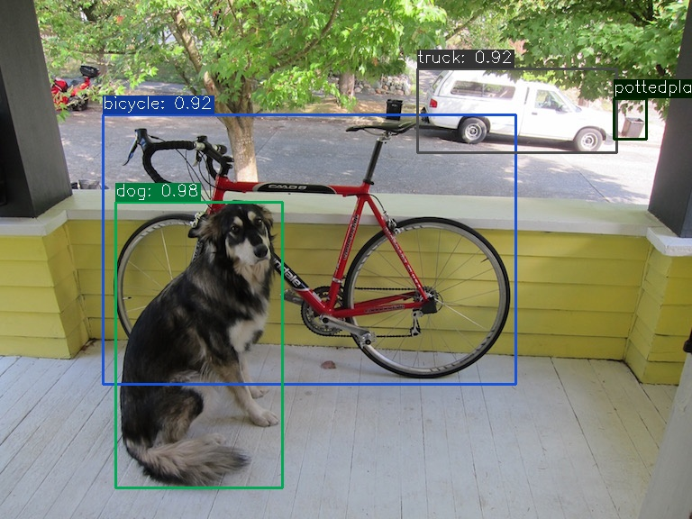

# Darknet YOLOv4, YOLOv3 to ONNX
## Description
This project can convert original AlexeyAB/darknet model weights & cfg to ONNX format.  

`main.py` shows all the steps as following:  
1. Export darknet weights to ONNX format via PyTorch
2. Run the inference including preprocessing & postprocessing
3. Visualize the result

Supported models:  
- [x] YOLOv4
- [x] YOLOv3
- [x] YOLOv4-csp (Scaled-YOLOv4)
- [x] YOLOv4-tiny

Other models are not tested but you can try

### Inference Result
Use `data/dog.jpg` as the example:
1. YOLOv4
    - Darknet
        ```bash
        bicycle: 92%    (left_x:  114   top_y:  128     width:  458     height:  299)
        dog: 98%        (left_x:  129   top_y:  225     width:  184     height:  317)
        truck: 92%      (left_x:  464   top_y:   77     width:  221     height:   93)
        pottedplant: 33%        (left_x:  681   top_y:  109     width:   37     height:  45)
        ```
    - DarknetONNX
        ```bash
        bicycle: 92%  (left_x:  114   top_y:  127     width:  458     height:  299)
        dog: 98%      (left_x:  128   top_y:  224     width:  185     height:  317)
        truck: 92%    (left_x:  463   top_y:  76      width:  221     height:  93)
        pottedplant: 33%        (left_x:  681   top_y:  109     width:  36      height:  45)
        ```
    |Framework|Image|
    |-|-|
    |darknet||  
    |darknetonnx||
2. YOLOv3
    - Darknet
        ```bash
        bicycle: 99%    (left_x:  117   top_y:  124   width:  452   height:  309)
        dog: 100%       (left_x:  124   top_y:  224   width:  196   height:  320)
        truck: 94%      (left_x:  474   top_y:   87   width:  217   height:   79)
        ```
    - DarknetONNX
        ```bash
        bicycle: 99%    (left_x:  116   top_y:  125     width:  453     height:  307)
        dog: 100%       (left_x:  122   top_y:  222     width:  197     height:  321)
        truck: 94%      (left_x:  472   top_y:  87      width:  220     height:  79)
        ```
3. YOLOv4-CSP
    - Darknet
        ```bash
        pottedplant: 31%        (left_x:   57   top_y:   71   width:   56   height:   64)
        bicycle: 94%    (left_x:  128   top_y:  132   width:  440   height:  288)
        dog: 90%        (left_x:  132   top_y:  221   width:  178   height:  320)
        truck: 84%      (left_x:  469   top_y:   74   width:  226   height:   97)
        ```
    - DarknetONNX
        ```bash
        bicycle: 92%    (left_x:  124   top_y:  127     width:  443     height:  293)
        dog: 91%        (left_x:  131   top_y:  222     width:  179     height:  318)
        truck: 85%      (left_x:  470   top_y:  75      width:  224     height:  96)
        ```
4. YOLOv4-tiny
    - Darknet
        ```bash
        bicycle: 60%    (left_x:   71   top_y:  100   width:  506   height:  379)
        dog: 84%        (left_x:  137   top_y:  206   width:  181   height:  332)
        truck: 79%      (left_x:  464   top_y:   80   width:  242   height:   91)
        car: 46%        (left_x:  473   top_y:   82   width:  225   height:   92)
        ```
    - DarknetONNX
        ```bash
        bicycle: 61%    (left_x:  71    top_y:  99      width:  505     height:  380)
        dog: 87%        (left_x:  136   top_y:  205     width:  183     height:  336)
        truck: 81%      (left_x:  464   top_y:  79      width:  240     height:  91)
        car: 39%        (left_x:  472   top_y:  81      width:  225     height:  92)
        ```
More visualizations & Inference speed comparison can be found at [docs/results/COMPARISON.md](docs/results/COMPARISON.md).  

## Installation
- torch 1.9.1
- numpy
- opencv-python
- onnx 1.7.0
- onnxruntime-gpu 1.7.0
- onnx-simplifier

## Usage
Must specify `--cfg` (`-c`), `--weight` (`-w`) and `--img` (`-i`) for the model conversion.
```bash
# darknet cfg & weights
python3 main.py --cfg cfg/yolov4.cfg --weight weights/yolov4.weights --img data/dog.jpg --names data/coco.names
python3 main.py --cfg cfg/yolov3.cfg --weight weights/yolov3.weights --img data/dog.jpg --names data/coco.names
python3 main.py --cfg cfg/yolov4-csp.cfg --weight weights/yolov4-csp.weights --img data/dog.jpg --names data/coco.names
# some custom cfg & weights
python3 main.py --cfg cfg/yolov4-obj.cfg --weight weights/yolov4-obj.weights --img your/img.jpg --names data/coco.names
# show only index if not specify `--names`
python3 main.py --cfg cfg/yolov4.cfg --weight weights/yolov4.weights --img data/dog.jpg
```
The script outputs `model.onnx` and `onnx_predictions.jpg`.

## YOLO Spec.
### `mask` in `[yolo]`
https://github.com/pjreddie/darknet/issues/558#issuecomment-376041045

### Decode Parts in Different Version of YOLO Models
YOLO Layer:
https://github.com/WongKinYiu/ScaledYOLOv4/issues/202#issuecomment-810913378

## Credit
- https://github.com/AlexeyAB/darknet
- https://github.com/Tianxiaomo/pytorch-YOLOv4
- https://github.com/Megvii-BaseDetection/YOLOX
