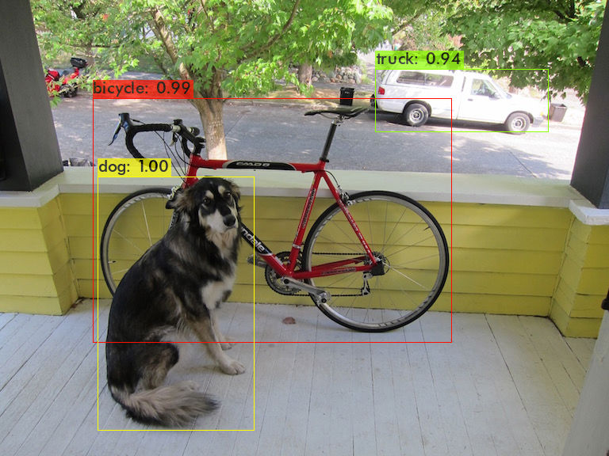
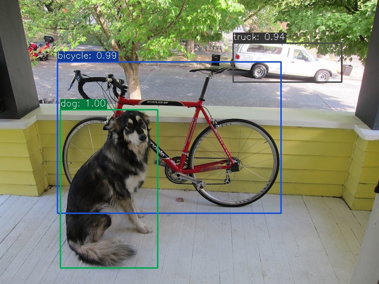
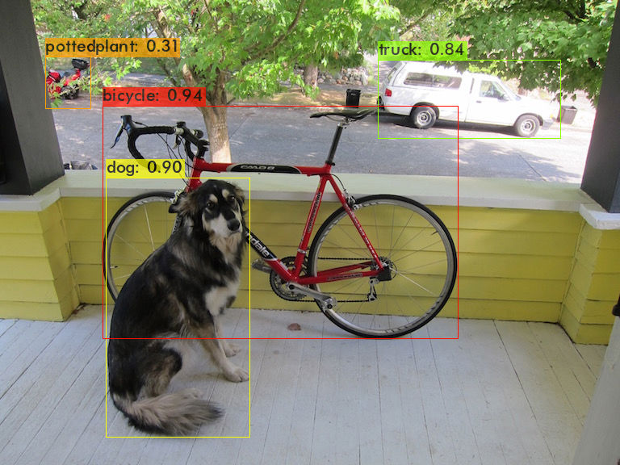
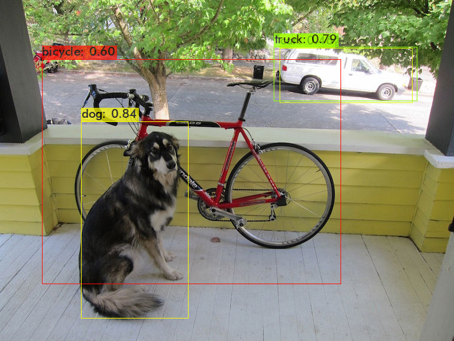
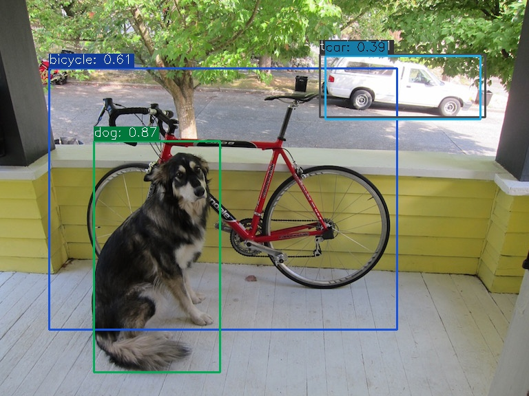

# Darknet vs. DarknetONNX
## Visualization
|Model|Framework|Image|
|-|-|-|
|YOLOv4|Darknet||  
|YOLOv4|ONNX||
|YOLOv3|Darknet||  
|YOLOv3|ONNX||
|YOLOv4-csp|Darknet||  
|YOLOv4-csp|ONNX||
|YOLOv4-tiny|Darknet||  
|YOLOv4-tiny|ONNX||

## Inference Speed & GPU Mem.
Tested on Ubuntu 18.04 with 1080ti & i7-7800X

|Model|Framework|Time per 1 Image|GPU Mem.|
|-|-|-|-|
|YOLOv4|Darknet|19.7ms|1.13GB|
|YOLOv4|ONNX|20.9ms|1.46GB|
|YOLOv3|Darknet|17.0ms|1.03GB|
|YOLOv3|ONNX|16.9ms|1.40GB|
